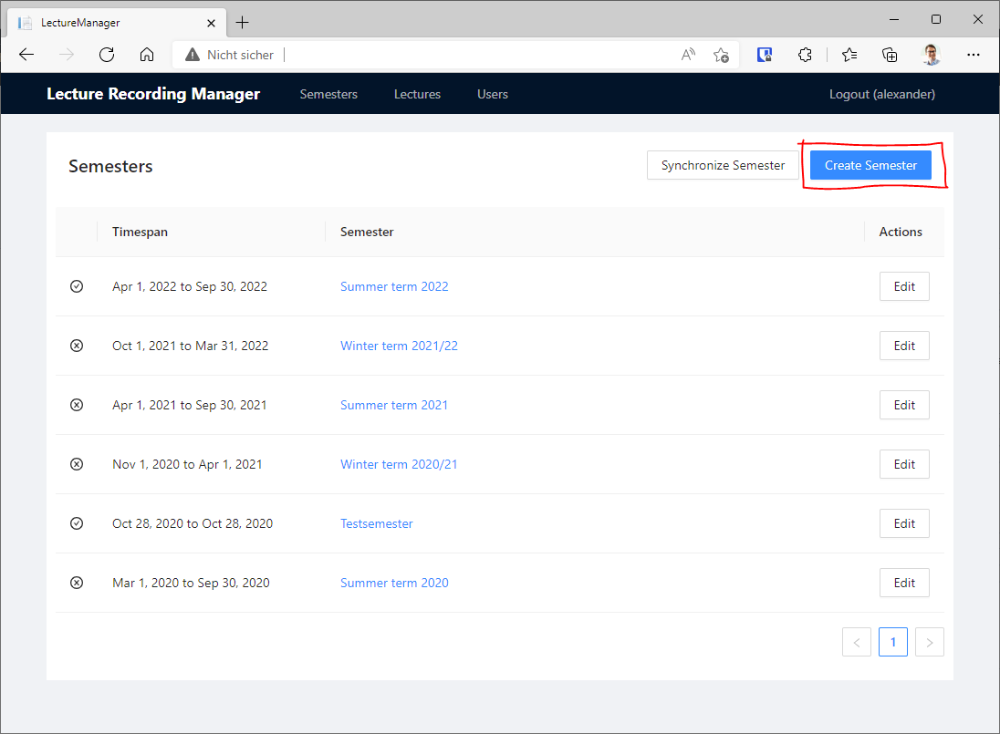
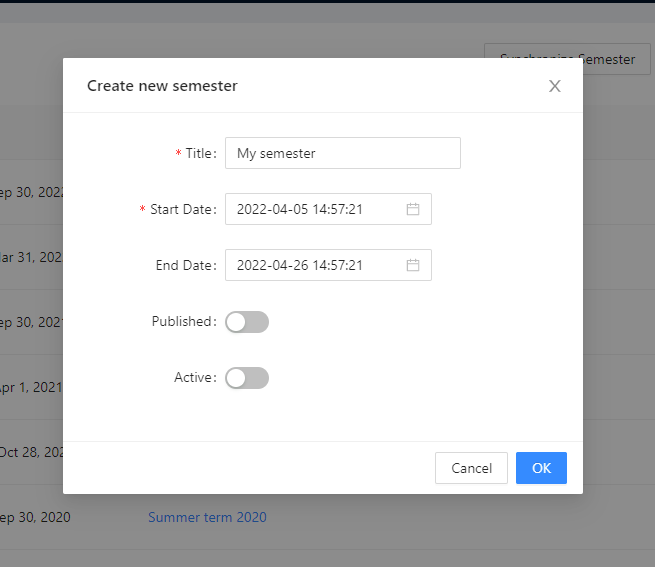
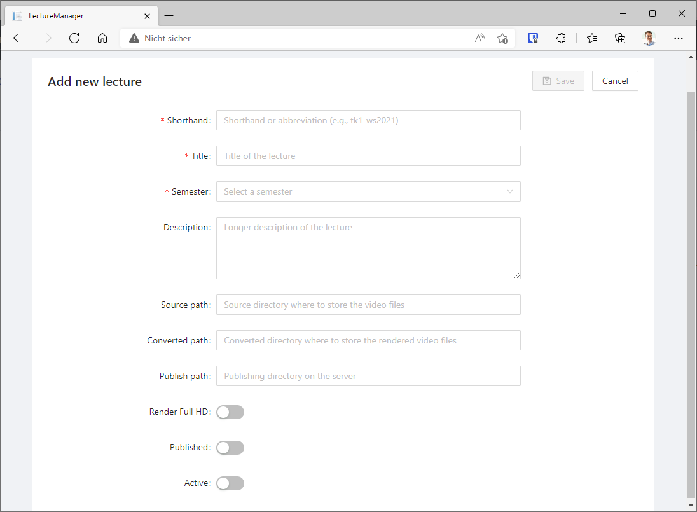
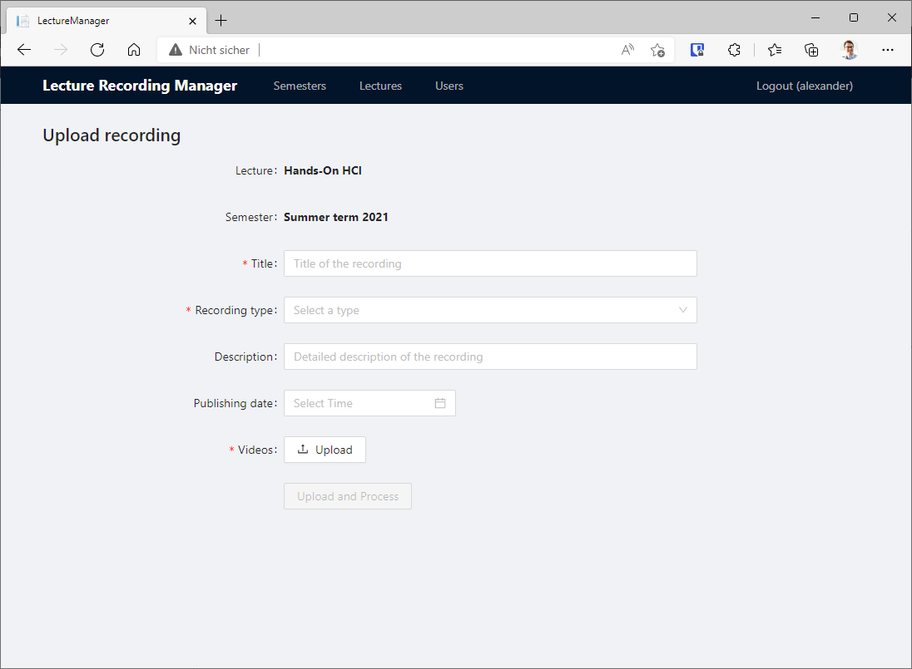

# Lecture Manager Documentation

## Create a new semester

Each recording is organized within a lecture which itself is organized into a semester.
A semester has a certain time period in which it is assumed to be active and centrally highlighted to the students.

1. Login to the lecture manager and click on **Create Semester**.

2. Fill out the title of the semester, the start and end date, as well as specify if the semester should be visible to the students.
You can also specify if the semester should be *active*, which automatically starts publishing lecture recordings.

## Create a new lecture

In order to store recordings, it is needed to create a lecture.
Note that a lecture can occur multiple times with the same name in different semesters.

1. Click on a semester and then click on **Add Lecture**

2. Fill out the following fields:

| Field          | Description                                                                    |
| -------------- | ------------------------------------------------------------------------------ |
| Shorthand      | A unique identifier for the lecture (must be unique in the entire system)      |
| Title          | Specifies the visible title of the lecture.                                    |
| Semester       | Specifies the semester of the lecture.                                         |
| Description    | A description of the lecture that is shown to the students.                    |
| Source path    | Specifies the directory that should be observed for new recordings (optional). |
| Converted path | Specifies the directory where to store converted recordings.                   |
| Publish path   | Specifies the directory where to move converted recordings when published.     |
| Render Full HD | Specifies, if the recordings should be rendered in FullHD.                     |
| Published      | Specifies, if the recordings should be published automatically.                |
| Active         | Specifies, if the lecture manager should automatically start processing jobs.  |

## Upload a new recording

You can manually upload a recording via the GUI.

1. Select a semester and a lecture you want to upload a recording to.

2. Click on **Upload Recording** to start a new upload.

3. Fill out the following fields:

| Field           | Description                                                       |
| --------------- | ----------------------------------------------------------------- |
| Title           | Specifies the title of the recording.                             |
| Recording Type  | Specifies the recording type (see below).                         |
| Description     | Specifies the description of the recording shown to the students. |
| Publishing date | Specifies a publishing date until the recording will be hidden.   |
| Videos          | Specifies the file(s) to upload for the recording.                |

### Recording Types

You can upload different video types:

| Recording Type                     | Description                                                                                                                                                             |
| ---------------------------------- | ----------------------------------------------------------------------------------------------------------------------------------------------------------------------- |
| Green Screen Studio                | Two videos (screen recording + talking head) where the talking head video was recorded with a green screen.                                                             |
| Simple Recording with Talking Head | Two videos (screen recording + talking head) where the talking head was recorded without a green screen. The videos will be transcoded in a combined side-by-side view. |
| Simple Screen Recording            | One video (screen recording)                                                                                                                                            |
| Zoom Recording                     | One video recorded using Zoom                                                                                                                                           |
